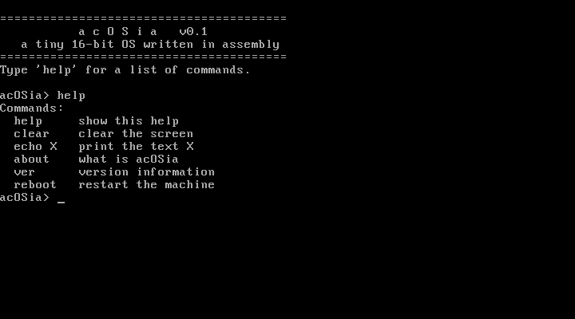

# acOSia

A tiny 16-bit operating system that boots on bare metal, loads its own kernel
from disk, and drops you into an interactive shell. Written from scratch in x86
assembly (NASM), with no operating system underneath it.



> This repo is the 16-bit assembly OS. A C++ counterpart, a 32-bit
> protected-mode kernel written in freestanding C++ with its own drivers, a
> feature demo, and a factory game, lives in its own repo:
> [AralCA/acOSia-cpp](https://github.com/AralCA/acOSia-cpp).

## What it does

- A stage-1 bootloader (512-byte boot sector) that the BIOS loads at `0x7C00`.
- It reads the kernel off the disk with BIOS interrupts and jumps to it.
- The kernel runs a small shell with a line editor (Backspace works) and these
  commands:

| Command  | Description            |
|----------|------------------------|
| `help`   | list commands          |
| `clear`  | clear the screen       |
| `echo X` | print text X           |
| `about`  | what acOSia is         |
| `ver`    | version info           |
| `reboot` | restart the machine    |

## Build and run

Requires [NASM](https://nasm.us) and [QEMU](https://www.qemu.org).

```powershell
./run.ps1      # builds the image and boots it in QEMU
```

Or build only:

```powershell
./build.ps1    # produces build/acosia.img
```

## How it works

```
BIOS -> loads 512 bytes -> boot.asm @ 0x7C00
                              |  reads 15 sectors via int 0x13
                              v
                          kernel.asm @ 0x8000
                              |  int 0x10 output, int 0x16 keyboard
                              v
                          shell loop -> parse and dispatch commands
```

- Real mode, 16-bit. I/O goes through BIOS services (`int 0x10` teletype,
  `int 0x16` keyboard), which are firmware calls rather than OS syscalls.
- The bootloader loads the kernel from the sectors right after itself, so the
  kernel is free to grow beyond the 512-byte boot sector.

## Run it on real hardware

`build/acosia.img` is a raw bootable floppy image. Write it to a USB stick
(Warning: this erases the stick) and boot from it:

- Easiest: [Rufus](https://rufus.ie), select the image, choose dd mode.
- Then pick the USB stick in your BIOS/UEFI boot menu (enable Legacy/CSM boot).

## Ideas for extending it

- More commands: `time` (read the CMOS clock), `mem`, a mini calculator.
- Command history with the up and down arrows.
- Switch to 32-bit protected mode and write straight to VGA memory (`0xB8000`).
- A `snake` game that runs inside the shell.
- Load the kernel via LBA (`int 0x13` AH=42h) instead of CHS.

## Layout

```
boot.asm     stage-1 bootloader (512 bytes)
kernel.asm   kernel + shell
build.ps1    assembles both and packs the disk image
run.ps1      builds, then launches QEMU
```

Built for fun and learning.
