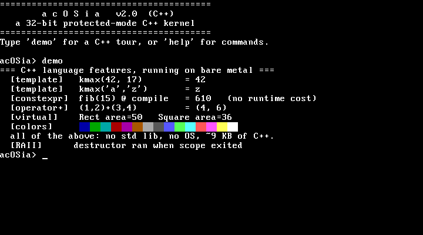
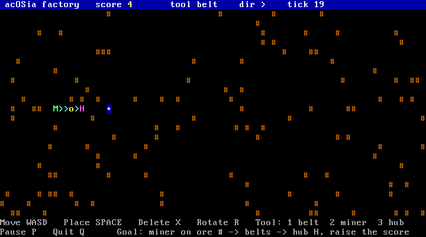

# acOSia v2, the C++ kernel

The 32-bit protected-mode evolution of acOSia. The bootloader is still x86
assembly, but the kernel (VGA driver, keyboard driver, and the whole shell) is
written in freestanding C++. No standard library, no OS beneath it: the C++
code talks to the hardware directly.



Type `demo` at the prompt for a live tour of C++ running on bare metal:
templates, `constexpr`, operator overloading, virtual dispatch, RAII destructors,
and colored output through the VGA driver (pictured above).

Type `factory` for a small real-time factory game, a tiny take on Factorio. Place
miners on ore, run belts to a hub, and watch items flow while the score climbs. A
starter chain is already running the moment you enter.



Controls: WASD to move, SPACE to place, X to delete, R to rotate, keys 1/2/3 to
pick belt/miner/hub, P to pause, Q to quit. The simulation is paced by the PIT
timer (no interrupts), input is polled, and all game state lives at a fixed
scratch address so the kernel still needs no heap.

## What is different from the 16-bit version

| | v1 (`../`) | v2 (this folder) |
|---|---|---|
| CPU mode | 16-bit real mode | 32-bit protected mode |
| Kernel language | assembly | freestanding C++ |
| Screen output | BIOS `int 0x10` | own VGA driver (writes `0xB8000`) |
| Keyboard | BIOS `int 0x16` | own PS/2 driver (polls `0x60`/`0x64`) |

In protected mode the BIOS interrupt services are gone, so the C++ kernel
implements its own drivers, which is what makes it interesting.

## Build and run

Needs NASM, QEMU, and the mingw-w64 `g++`/`ld`/`objcopy`.

```powershell
./run.ps1      # builds and boots in QEMU (as a hard disk)
./build.ps1    # build only, produces build/acosia.img
```

## How it works

```
BIOS -> boot.asm @ 0x7C00 (16-bit real mode)
          |  1. load the kernel from disk (int 13h AH=42h, LBA read)
          |  2. enable the A20 line
          |  3. load a flat GDT, set CR0.PE, far-jump to 32-bit code
          v
       kernel_entry.asm @ 0x10000 (32-bit)
          |  call _kmain
          v
       kernel.cpp: Vga + Keyboard + Shell classes
          VGA text at 0xB8000, PS/2 keyboard at 0x60/0x64
```

## Build pipeline

Bare-metal C++ on a Windows/mingw toolchain has a few sharp edges, all handled in
`build.ps1`:

1. `g++ -m32 -ffreestanding` compiles the kernel with no standard library.
2. SSE, MMX, and x87 are disabled (`-mno-sse -mno-sse2 -mno-mmx -mno-80387`). At
   `-O2` the compiler otherwise auto-vectorizes loops into SSE instructions, which
   fault (`#UD`) because SSE is off (`CR4=0`). With no IDT set up, that fault
   triple-faults the machine. Disabling SSE keeps codegen to general-purpose
   registers.
3. `memcpy` and `memset` are provided in the kernel, since the compiler may emit
   calls to them and there is no libc here to supply them.
4. mingw's `ld` only emits PE, so we link a 32-bit PE with `.text` based at
   `0x10000`, then `objcopy -O binary` flattens the real sections into a raw
   kernel the bootloader can load and jump straight into.

## Notes and next steps

- The keyboard is polled, so no IDT or interrupts are needed yet. Adding an IDT,
  a PIC remap, and an IRQ1 handler would make it interrupt-driven.
- No shift or caps yet: the scancode table maps unshifted keys only.
- Natural extensions: command history, a heap plus `new`/`delete`, colored text,
  a `snake` game using the VGA driver.

## Files

```
boot.asm          bootloader: disk load + protected-mode switch + GDT
kernel_entry.asm  32-bit stub that calls into C++
kernel.cpp        VGA driver, PS/2 keyboard driver, shell (all C++)
build.ps1         assemble + compile + link + flatten + pack image
run.ps1           build, then boot in QEMU
```
